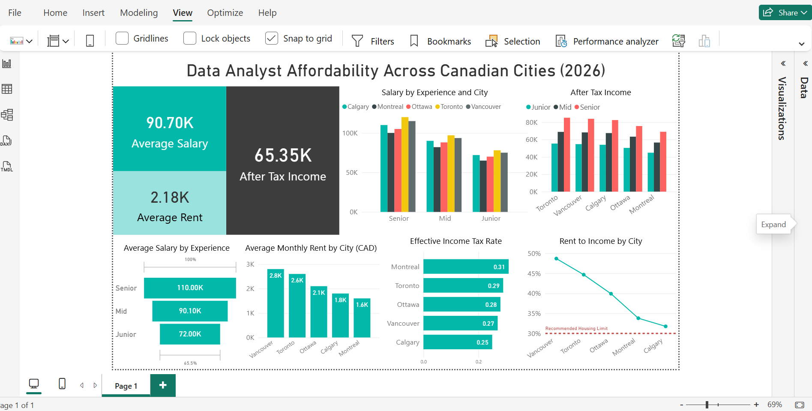

# Data Analyst Affordability Across Canadian Cities (2026)

This project analyzes how affordable it is for Data Analysts to live in major Canadian cities by comparing salary levels, rent prices, and effective income tax rates.

The goal of this analysis is to understand how much of a Data Analyst’s income is typically spent on housing and which cities offer better financial conditions.

---

## 📊 Dashboard Overview

The Power BI dashboard explores:

- Average Data Analyst salaries by experience level
- After-tax income by city
- Average monthly rent
- Effective income tax rate by province
- Rent-to-income ratio (housing affordability indicator)

Cities included in the analysis:

- Vancouver
- Toronto
- Ottawa
- Montreal
- Calgary

---

## 📈 Key Insights

Some insights revealed in the analysis:

- Vancouver and Toronto have the **highest rent levels**, reducing housing affordability.
- Calgary offers the **lowest rent-to-income ratio**, making it the most affordable city among those analyzed.
- Tax rates vary across provinces and significantly affect **after-tax income**.
- Senior Data Analysts earn significantly more, improving affordability compared to junior roles.

---

## 🛠 Tools Used

- **Power BI**
- **DAX (Data Analysis Expressions)**
- **Excel (data preparation)**

---

## 📁 Project Structure

data-analyst-affordability-canada
│
├── data
│ └── salary_rent_dataset.xlsx
│
├── dashboard
│ └── affordability_dashboard.pbix
│
├── images
│ └── dashboard_preview.png
│
└── README.md

---

## 📷 Dashboard Preview

---

## 🎯 Purpose

This project was created as part of a **Data Analytics portfolio** to demonstrate skills in:

- Data visualization
- Dashboard design
- Data analysis
- Business insights generation

---

## 👤 Author

**Rayan Serratine**

Data Analytics & Full-Stack Development Student  
Vancouver, Canada
